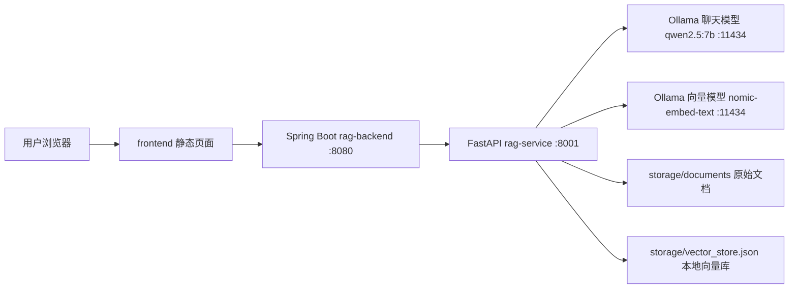
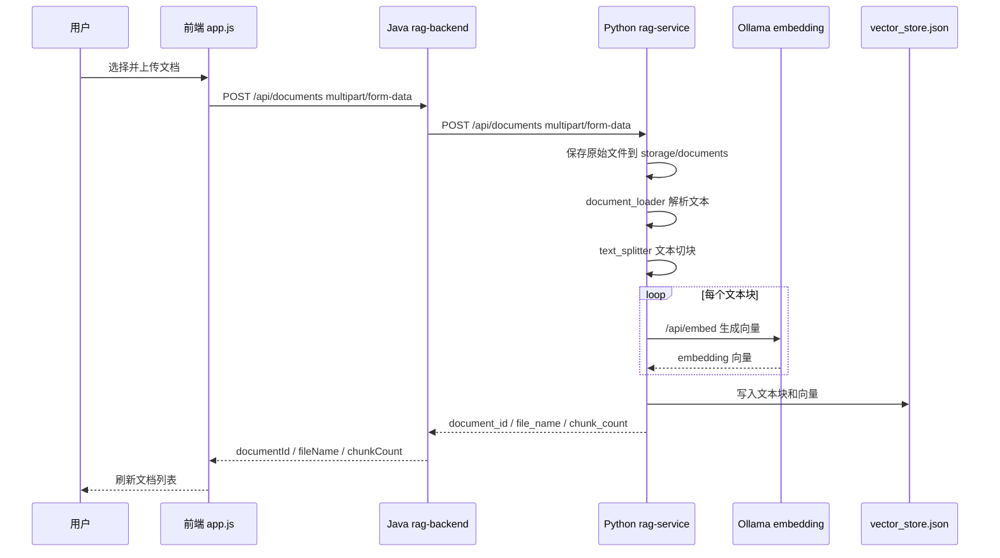
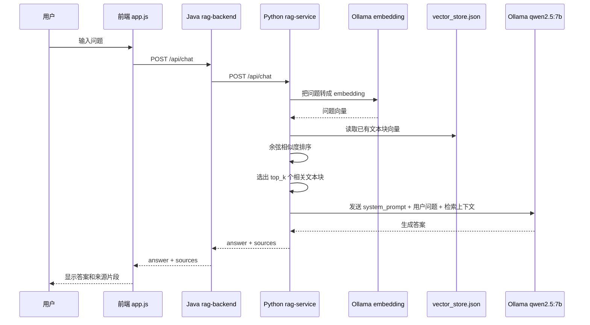

# RAG 企业内部知识问答系统 V0.1 设计说明

## 1. 系统定位

这个项目是一个学习版企业内部知识问答系统。

它的核心目标是：

```text
上传企业文档
-> 文档解析
-> 文本切块
-> 向量化
-> 存入本地向量库
-> 用户提问
-> 检索相关资料
-> 大模型基于资料回答
```

这个流程就是典型的 RAG：

```text
Retrieval-Augmented Generation
检索增强生成
```

## 2. 项目整体结构

```text
RAG企业内部知识问答系统_V0.1
├─ frontend
│  ├─ index.html          前端页面
│  ├─ style.css           页面样式
│  └─ app.js              前端请求逻辑
│
├─ rag-backend
│  ├─ pom.xml             Spring Boot 项目配置
│  └─ src/main/java/com/rag
│     ├─ RagApplication.java
│     ├─ config
│     │  └─ WebConfig.java
│     ├─ controller
│     │  ├─ ChatController.java
│     │  └─ DocumentController.java
│     ├─ model
│     │  ├─ ChatRequest.java
│     │  ├─ ChatResponse.java
│     │  ├─ DocumentInfo.java
│     │  ├─ HealthResponse.java
│     │  └─ SourceChunk.java
│     └─ service
│        └─ RagService.java
│
├─ rag-service
│  ├─ requirements.txt    Python 依赖
│  └─ app
│     ├─ main.py          Python RAG 接口入口
│     ├─ config.py        模型、路径、切块参数配置
│     ├─ models.py        Python 请求/响应模型
│     └─ services
│        ├─ document_loader.py
│        ├─ text_splitter.py
│        ├─ ollama_client.py
│        └─ vector_store.py
│
├─ start-all.bat          同时启动 Java 和 Python
├─ start-java.bat         启动 Spring Boot
└─ start-python.bat       启动 Python RAG 服务
```

## 3. 项目架构图



## 4. Java 和 Python 怎么通信

它们不是通过函数调用，也不是通过共享内存，而是通过 **HTTP 接口通信**。

Java 的 `rag-backend` 运行在：

```text
http://127.0.0.1:8080
```

Python 的 `rag-service` 运行在：

```text
http://127.0.0.1:8001
```

Java 在配置文件里保存 Python 地址：

```yaml
rag:
  python-service-url: http://127.0.0.1:8001
```

对应文件：

```text
rag-backend/src/main/resources/application.yml
```

Java 里真正发请求的是：

```text
rag-backend/src/main/java/com/rag/service/RagService.java
```

它使用：

```java
RestTemplate
```

所以通信方式可以理解成：

```text
前端请求 Java
Java 用 RestTemplate 请求 Python
Python 返回 JSON
Java 把 JSON 转成 Java record
Java 再返回给前端
```

## 5. 接口对应关系

| 前端请求 Java | Java 转发 Python | 作用 |
|---|---|---|
| `GET /api/health` | `GET /api/health` | 检查服务和模型配置 |
| `POST /api/documents` | `POST /api/documents` | 上传文档并建立向量索引 |
| `GET /api/documents` | `GET /api/documents` | 获取文档列表 |
| `DELETE /api/documents/{id}` | `DELETE /api/documents/{id}` | 删除文档索引 |
| `POST /api/chat` | `POST /api/chat` | 提问并返回 RAG 答案 |

## 6. 上传文档数据流



## 7. 用户提问数据流



## 8. RAG 核心代码在哪里

真正做 RAG 的地方在 Python：

```text
rag-service/app/main.py
```

里面两个核心接口：

```python
upload_document()
```

负责入库：

```text
文件 -> 文本 -> 切块 -> embedding -> vector_store.json
```

```python
chat()
```

负责问答：

```text
问题 -> embedding -> 检索 -> 拼上下文 -> 大模型回答
```

## 9. 每个后端模块职责

### Java rag-backend

`RagApplication.java`

Spring Boot 启动入口。

`WebConfig.java`

把 `frontend` 目录映射成静态页面，让用户访问 `http://127.0.0.1:8080` 就能看到页面。

`DocumentController.java`

接收文档上传、文档列表、删除文档、健康检查请求。

`ChatController.java`

接收用户提问请求。

`RagService.java`

Java 和 Python 通信的核心。它用 `RestTemplate` 调 Python 服务。

`model/*.java`

Java 请求和响应数据结构。

### Python rag-service

`main.py`

Python RAG API 入口，串起所有流程。

`config.py`

配置路径、Ollama 地址、模型名、切块大小。

`models.py`

FastAPI 请求/响应模型。

`document_loader.py`

负责读取 `txt/md/pdf/docx` 文档内容。

`text_splitter.py`

负责把长文本切成小块。

`ollama_client.py`

负责调用 Ollama 的 embedding 和 chat 接口。

`vector_store.py`

学习版向量库，使用 JSON 文件保存文本块和向量，并用余弦相似度检索。

## 10. 为什么要 Java + Python 两层

这个项目的设计思路是：

```text
Java 负责业务后端和前端入口
Python 负责 AI / RAG 能力
```

这样做有几个好处：

1. Java 适合你熟悉的后端业务，比如用户、权限、订单、企业系统对接。
2. Python 生态更适合 RAG，比如文档解析、向量库、LangChain、模型调用。
3. 两者用 HTTP 解耦，以后 Python RAG 服务可以单独升级，不影响 Java 主系统。

## 11. 当前版本局限

当前项目是学习版，还有这些限制：

1. 向量库是 JSON 文件，不适合大规模文档。
2. 没有用户登录和权限控制。
3. 没有文档去重。
4. 删除文档只删除向量索引，没有删除原始文件。
5. 没有流式输出。
6. 没有混合检索，只有向量检索。
7. 没有知识图谱和 Neo4j。

## 12. 后续升级方向

建议升级顺序：

```text
1. 把 JSON 向量库换成 Chroma / Milvus / Qdrant / pgvector
2. 加用户登录和文档权限
3. 加流式回答
4. 加 BM25 + 向量混合检索
5. 加 rerank 重排序
6. 加 Neo4j 知识图谱
7. 加文档管理后台
8. 加问答历史记录
```

## 13. 一句话总结

这个系统的核心不是“Java 调 Python”本身，而是：

```text
Java 作为业务入口
Python 作为 AI 能力服务
Ollama 作为本地模型
JSON 向量库作为学习版知识库
```

Java 和 Python 之间通过 HTTP/JSON 通信，RAG 的核心逻辑集中在 Python 服务中。
